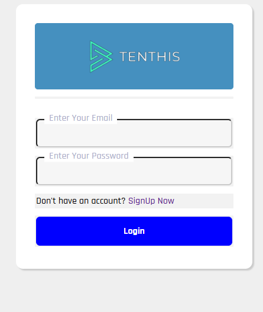

# Tenthis

> A lightweight PHP-based task and reward platform where users can complete tasks, earn rewards, manage their wallet, use referrals, and request withdrawals.

[](https://www.php.net/)
[](https://www.mysql.com/)
[](LICENSE)

---

## 📌 About

**Tenthis** is a lightweight task-and-reward web application built with PHP and MySQL.

The project provides the basic building blocks for a rewards platform, including user authentication, referral tracking, task management, wallet functionality, withdrawals, and shortlink integrations.

It is designed primarily as a learning project and a foundation that can be extended with additional task providers, APIs, payment systems, fraud detection, and analytics.

---

## ✨ Features

### 👤 User System

* User registration
* Login and logout
* User profiles
* Password management
* Session-based authentication

### 🎯 Task System

* Browse available tasks
* View task details
* Complete tasks and receive rewards
* Task history
* Admin task management

### 💰 Wallet & Rewards

* User wallet
* Reward tracking
* Wallet balance management
* Withdrawal requests
* Withdrawal history

### 🤝 Referral System

* Referral links
* Referral tracking
* Referral validation
* Referral-based rewards

### 🔗 API Integration

The project includes lightweight endpoints inside `APIS/` for integrating external shortlink/task systems.

These endpoints can be extended to support:

* Task synchronization
* Task verification
* Completion callbacks
* Reward processing
* External API integrations

> **Important:** External providers may have their own API, traffic, incentivization, and payout requirements. Review their terms before integrating them into a production deployment.

### 🛠️ Admin Panel

The admin area provides functionality for managing:

* Users
* Tasks
* Withdrawals
* Rewards
* Platform activity

### 📸 Screenshots

<div align="center">
  
  
  
  <p><i>Left: User Dashboard | Right: Admin Panel</i></p>
</div>

---

## 🧰 Tech Stack

| Technology      | Purpose                     |
| --------------- | --------------------------- |
| PHP             | Backend application         |
| MySQL / MariaDB | Database                    |
| HTML / CSS      | Frontend                    |
| JavaScript      | Client-side interactions    |
| Apache          | Local/production web server |
| XAMPP / WAMP    | Local development           |

---

## 📁 Project Structure

```text
tenthis/
│
├── gfkjkjer/
│   └── admin/              # Admin panel
│
├── img/                    # Images and assets
│
├── php/                    # Shared PHP files
│   ├── connection.php      # Database connection
│   ├── function.php        # Shared functions
│   └── ...
│
├── APIS/             # API integrations
│
├── .htaccess               # Apache configuration
├── index.php               # Homepage
├── login.php               # Login
├── signup.php              # Registration
├── logout.php              # Logout
├── profile.php             # User profile
├── refer.php               # Referral system
├── task_offer.php          # Task listing
├── view_task.php           # Task details
├── students_offer.php      # Student offers
├── short.php               # Shortlink functionality
├── long.php                # Long-link handling
├── withdraw.php             # Withdrawal requests
├── withdraw_history.php    # Withdrawal history
├── update_wallet.php       # Wallet updates
├── verify.php              # Verification
├── contact.php             # Contact page
├── feedback.php            # Feedback
├── history.php             # User history
├── script.js               # JavaScript
├── style_.css              # Base styles
├── style_light.css         # Light theme
├── style_dark.css          # Dark theme
├── userform.sql            # Database schema
└── README.md
```

---

## ⚙️ Requirements

Before installing Tenthis, make sure you have:

* PHP **7.4 or newer**
* MySQL or MariaDB
* Apache or another PHP-compatible web server
* XAMPP, WAMP, Laragon, or equivalent local environment
* A web browser

For production, use a currently supported PHP version rather than an outdated PHP release.

---

## 🚀 Installation

### 1. Clone the repository

```bash
git clone https://github.com/epic-piyush/tenthis.git
cd tenthis
```

Or download the repository as a ZIP and extract it into your web server's document root.

---

### 2. Start your local server

For XAMPP:

1. Start **Apache**
2. Start **MySQL**
3. Make sure PHP is working correctly

Place the project inside:

```text
xampp/htdocs/
```

For example:

```text
xampp/htdocs/tenthis/
```

---

### 3. Create the database

Open **phpMyAdmin** and create a database.

For example:

```text
tenthis
```

Then import:

```text
userform.sql
```

You can also import it from the MySQL command line:

```bash
mysql -u root -p tenthis < userform.sql
```

---

### 4. Configure the database

Open:

```text
php/connection.php
```

and configure your database credentials.

Example:

```php
$host = "localhost";
$username = "root";
$password = "";
$database = "tenthis";
```

If you use the API integration, check:

```text
APIS/connection.php
```

and configure it as required.

**Never commit production database passwords, API keys, or other secrets to GitHub.**

---

### 5. Open the application

For XAMPP, open:

```text
http://localhost/tenthis/
```

You should now see the Tenthis homepage.

---

## 🔐 Security

Tenthis is currently a lightweight project and should be **reviewed and hardened before being exposed to the public internet**.

Important areas to review include:

* Prepared SQL statements
* Input validation
* Output escaping
* Password hashing
* Session security
* CSRF protection
* Authentication and authorization
* Admin access control
* Rate limiting
* Wallet/reward transaction integrity
* Withdrawal validation
* API authentication
* Webhook/postback verification
* Secret/API-key management

### Never store passwords as plain text

Use PHP's password hashing functions:

```php
password_hash($password, PASSWORD_DEFAULT);
```

and verify them with:

```php
password_verify($password, $hash);
```

### Protect secrets

Do not commit files containing:

```text
Database passwords
API keys
API secrets
Private tokens
Production credentials
```

Use environment variables or another secure secret-management approach for production.

---

## 💳 Reward & Wallet Integrity

Because Tenthis handles user rewards and wallet balances, reward operations should be treated as **financially sensitive operations**.

A production implementation should ensure that:

```text
Task completion
      ↓
Server-side verification
      ↓
Transaction validation
      ↓
Reward credited
      ↓
Ledger entry created
```

The browser should **never be trusted to directly award itself money or rewards**.

For external task/shortlink integrations, use provider-supported server-side verification or signed callbacks where available.

---

## 🔗 API Integrations

The `APIS/` directory is intended as an integration layer for external services.

A recommended production flow is:

```text
User
 │
 ▼
Tenthis
 │
 │ Start task
 ▼
External provider
 │
 │ User completes task
 ▼
Provider verification
 │
 │ Server-to-server callback
 ▼
Tenthis API
 │
 │ Verify request
 ▼
Task marked completed
 │
 ▼
Reward credited
```

**API integrations currently is as the tenthis website is running in another tab it validates user by the stored cookies, you can make it as your own comfort**

Avoid trusting client-side parameters such as:

```text
?completed=true
```

as proof of task completion.

---

## 🧪 Development

For local debugging, PHP errors can be enabled temporarily:

```php
ini_set('display_errors', 1);
error_reporting(E_ALL);
```

Do **not** leave detailed error output enabled on a production server.

<!-- ---

## 🗺️ Roadmap

Possible future improvements:

* [ ] Modernize the PHP codebase
* [ ] Improve database schema
* [ ] Add `.env` configuration
* [ ] Add CSRF protection
* [ ] Improve authentication security
* [ ] Add password reset
* [ ] Add email verification
* [ ] Add API authentication
* [ ] Add proper task completion callbacks
* [ ] Add transaction ledger
* [ ] Add reward fraud detection
* [ ] Add rate limiting
* [ ] Improve admin dashboard
* [ ] Add task analytics
* [ ] Add automated tests
* [ ] Add Docker support
* [ ] Add production deployment documentation -->

---

## 🤝 Contributing

Contributions are welcome.

### 1. Fork the repository

```bash
git clone https://github.com/epic-piyush/tenthis.git
```

### 2. Create a branch

```bash
git checkout -b feature/my-feature
```

### 3. Make your changes

Keep changes focused and document any configuration or database changes.

### 4. Commit your changes

```bash
git add .
git commit -m "Add my feature"
```

### 5. Push your branch

```bash
git push origin feature/my-feature
```

Then open a Pull Request.

---

## 🐛 Issues

If you find a bug or have a feature request, open an issue in the repository.

When reporting a bug, include:

* PHP version
* MySQL/MariaDB version
* Operating system
* Steps to reproduce
* Expected behavior
* Actual behavior
* Relevant error messages

Please **do not post passwords, API keys, database credentials, or other secrets in issues**.

---

## 📜 License

This project is licensed under the **MIT License**.

See [`LICENSE`](LICENSE) for details.

---

## 👨‍💻 Author

**Piyush**

GitHub: [@epic-piyush](https://github.com/epic-piyush)

Repository: [epic-piyush/tenthis](https://github.com/epic-piyush/tenthis)

---

## ⭐ Support the Project

If you find Tenthis useful or interesting:

* ⭐ Star the repository
* 🐛 Report bugs
* 💡 Suggest improvements
* 🔧 Submit pull requests
* 📚 Use it as a learning project

---

> **Tenthis is a learning-focused project and should be security-audited and properly configured before being used for real-money production workloads.**
